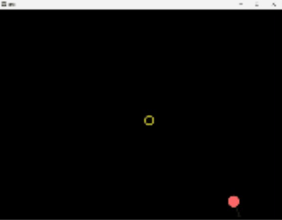

# Ball Game

A physics-based ball game built with Python and Kivy where players drag and release a ball to collect spinning coins while enjoying visual trails and sound effects.

## 🎮 Game Overview

Control a bouncing ball by dragging and releasing it to collect spinning golden coins scattered around the screen. The ball follows realistic physics with gravity, bouncing off walls, and momentum conservation. Visual trails follow the ball's movement with dynamic color changes, creating an engaging and visually appealing experience.

## ✨ Features

- **Physics-Based Movement**: Realistic ball physics with gravity, velocity, and acceleration
- **Interactive Controls**: Drag and release mechanics for intuitive ball control
- **Coin Collection**: Spinning animated coin that boost the ball when collected
- **Visual Effects**: Dynamic color-changing trails that follow the ball's path
- **Sound Effects**: Audio feedback for coin collection
- **Boundary Collision**: Ball bounces off screen edges with configurable restitution
- **Auto-Respawn**: Coins automatically relocate every 10 seconds if not collected

## 🧠 Physics Concepts Used

- **Newton’s Second Law**:  
  Acceleration causes changes in velocity (`v += a * dt`) and displacement (`p += v * dt + 0.5 * a * dt * dt`)

- **Gravity Simulation**:  
  Constant downward acceleration (`a = 980 px/s²`)

- **Elastic Collisions**:  
  When the ball hits a surface, its velocity is reversed and scaled by a restitution factor

- **Mouse Impulse Control**:  
  Drag-and-release sets the velocity vector based on the distance and direction of drag
<<<<<<< HEAD

## 🎯 How to Play

1. **Launch the game** - The ball starts in the center of the screen
2. **Drag the ball** - Click or touch and drag to aim your shot
3. **Release to launch** - Let go to propel the ball in the desired direction (ball will slightly slow down when held)
4. **Collect coins** - Guide the ball to touch the spinning golden coins
5. **Get boosted** - Collecting coins gives the ball an automatic speed boost
6. **Keep playing** - Coins will relocate automatically, providing endless gameplay

## 📸 Demo

## 🛠️ Technical Architecture

### Core Components

#### `ball.py` - Ball Physics Engine
- Implements realistic physics simulation with position, velocity, and acceleration vectors
- Handles collision detection with screen boundaries
- Manages drag-and-release interaction mechanics
- Provides boost and reset functionality
- Uses Kivy's graphics system for smooth rendering

#### `coin.py` - Interactive Collectibles
- Creates animated spinning coins with 3D rotation effect
- Implements collision detection with the ball
- Handles random relocation across the screen
- Uses trigonometric functions for realistic spin animation

#### `trail.py` - Visual Effects System
- Generates dynamic trails following the ball's movement
- Implements color-changing effects with configurable timing
- Uses efficient deque data structure for performance
- Provides semi-transparent visual effects

#### `sound.py` - Audio Management
- Loads and manages game sound effects
- Provides safe audio playback with stop/play functionality
- Easily extensible for additional sound effects

#### `config.py` - Game Configuration
- Centralizes physics constants and game parameters
- Allows easy tuning of gameplay mechanics
- Maintains consistency across all game components

#### `main.py` - Game Loop and Coordination
- Orchestrates all game components and systems
- Implements the main game loop with consistent frame rate
- Handles user input and game state management
- Coordinates collision detection and game events

### Prerequisites
- Python 3.7 or higher
- Kivy framework
- Basic Linear Algebra

### Configurations
- GRAVITY = 980               # Gravitational force (pixels/second²)
- FPS = 60                    # Target frame rate
- RESTITUTION = 0.8           # Bounce factor (0.0 = no bounce, 1.0 = perfect bounce)
- BALL_RADIUS = 20            # Ball size in pixels

## 🎯 How to Play

1. **Launch the game** - The ball starts in the center of the screen
2. **Drag the ball** - Click or touch and drag to aim your shot
3. **Release to launch** - Let go to propel the ball in the desired direction
4. **Collect coins** - Guide the ball to touch the spinning golden coins
5. **Get boosted** - Collecting coins gives the ball an automatic speed boost
6. **Keep playing** - Coins will relocate automatically, providing endless gameplay

## 📸 Demo

[🎬 Watch the Demo](demo/demo_classic.mp4)

## 🛠️ Technical Architecture

### Core Components

#### `ball.py` - Ball Physics Engine
- Implements realistic physics simulation with position, velocity, and acceleration vectors
- Handles collision detection with screen boundaries
- Manages drag-and-release interaction mechanics
- Provides boost and reset functionality
- Uses Kivy's graphics system for smooth rendering

#### `coin.py` - Interactive Collectibles
- Creates animated spinning coins with 3D rotation effect
- Implements collision detection with the ball
- Handles random relocation across the screen
- Uses trigonometric functions for realistic spin animation

#### `trail.py` - Visual Effects System
- Generates dynamic trails following the ball's movement
- Implements color-changing effects with configurable timing
- Uses efficient deque data structure for performance
- Provides semi-transparent visual effects

#### `sound.py` - Audio Management
- Loads and manages game sound effects
- Provides safe audio playback with stop/play functionality
- Easily extensible for additional sound effects

#### `config.py` - Game Configuration
- Centralizes physics constants and game parameters
- Allows easy tuning of gameplay mechanics
- Maintains consistency across all game components

#### `main.py` - Game Loop and Coordination
- Orchestrates all game components and systems
- Implements the main game loop with consistent frame rate
- Handles user input and game state management
- Coordinates collision detection and game events

### Prerequisites
- Python 3.7 or higher
- Kivy framework
- Basic Linear Algebra

### Configurations
-* **GRAVITY** = 980               # Gravitational force (pixels/second²)
- **FPS** = 60                    # Target frame rate
- **RESTITUTION** = 0.8           # Bounce factor (0.0 = no bounce, 1.0 = perfect bounce)
- **BALL_RADIUS** = 20            # Ball size in pixels

## 🎨 Customization options

### Visual Customizations
- **Ball Color:** Modify the Color(1, 0.4, 0.4) in ball.py
- **Coin Color:** Change Color(1, 1, 0) in coin.py
- **Trail Effects:** Adjust opacity and color change timing in trail.py

### Gameplay Mechanics
- **Coin Relocation:** Modify the 10-second timer in main.py
- **Boost Strength:** Adjust the boost multiplier in ball.py
- **Trail Length:** Change max_length parameter in Trail initialization

## 🐛 Troubleshooting
- **Game won't start:** Ensure Kivy is properly installed and all Python files are in the same directory
- **No sound:** Verify boink_sound.wav is present in the project directory
- **Performance issues:** Try reducing FPS in config.py or trail length in main.py
